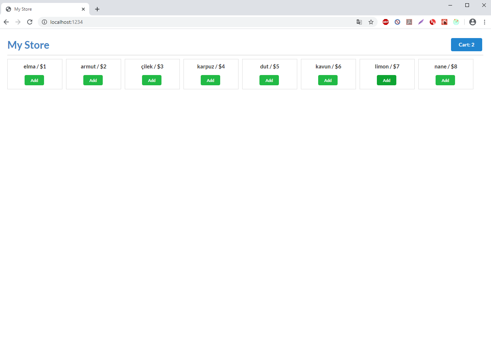
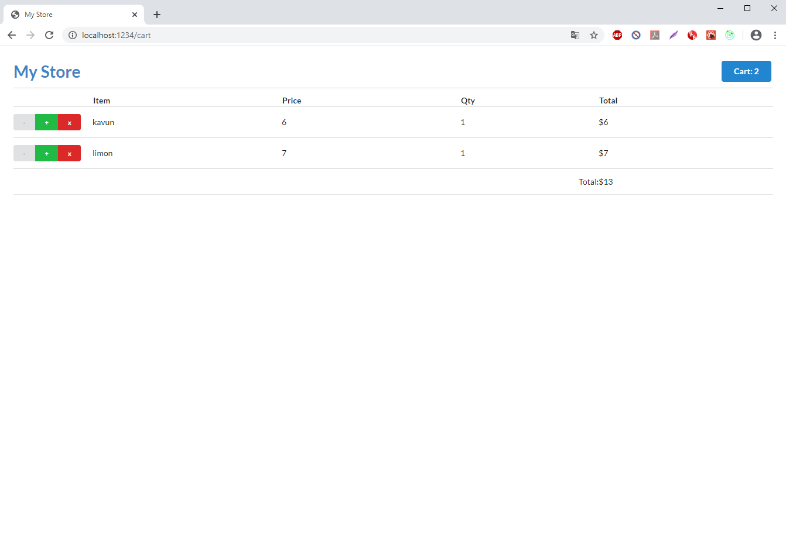

# Redux Tutorial with ReactJs

Redux'u tam anlayabilmek için react ve redux ile yaptığım store cart uygulaması...

### ReactJs with Parcel

Webpack yerine parcel kullandım. Çünkü sürekli integrasyon sağlıyor. Hot module kurmana gerek kalmıyor.

### npm install

İle package.json dosyasında bulunan development ve project dependencies'leri indirin.

Kurulum tamamlandıktan sonra,

### npm run dev

İle uygulamayı development modunda çalıştırın. Uygulamaya browser'da http://localhost:1234 yazarak ulaşabilirsiniz.

### npm run format

İle koda yenilikler eklemeden bir kere çalıştırın. Bu prettier script'i olarak bütün src klasöründeki dosyaları jsx formatında düzenler. Ayrıca Visual Studio Code kullanıyorsanız bu eklentiyi indirmenizi şiddetle tavsiye ederim.

### Ekran Görüntüleri

